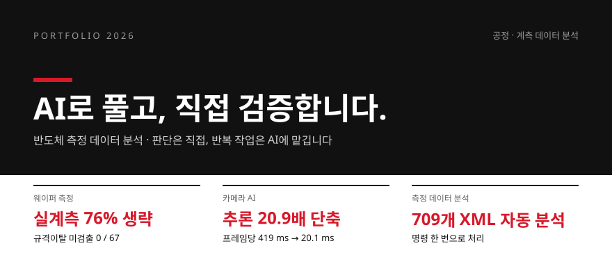
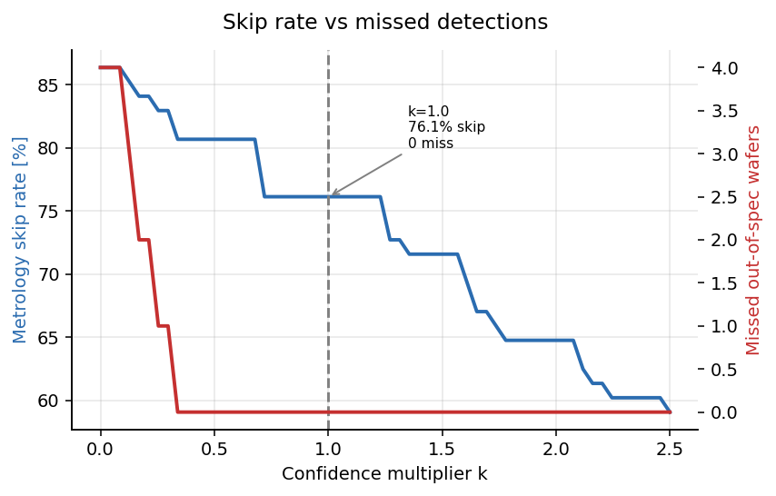
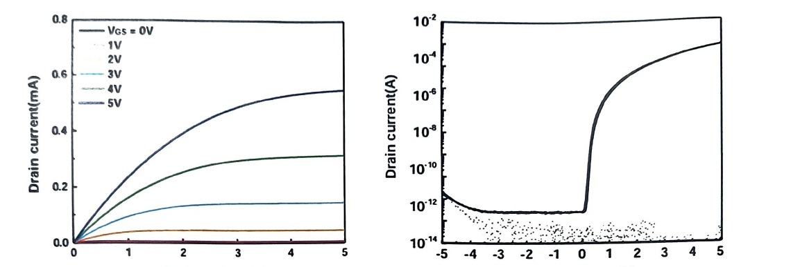

# 이재혁 · Jaehyeok Lee

반도체 공정·계측 데이터를 분석합니다. 물리 모델과 검증 기준은 직접 세우고, 반복 구현은 AI에 맡깁니다.

한양대학교 ERICA 차세대반도체융합공학부 반도체디스플레이전공 3학년 · 팹리스 점프업 2기
dw647768@gmail.com · [포트폴리오 PDF](assets/portfolio/portfolio_2026.pdf)

---

## 작업 방식

처음에는 AI에 곡선을 맞춰 달라고만 했고, 세 번 실패했습니다. 그 뒤로는 아래 순서로 작업합니다.

| 순서 | 하는 일 |
|---|---|
| 1. 모델을 먼저 세운다 | 식, 축의 물리량, 규격을 정한 뒤 코드를 요청합니다. MZI 간섭 모델과 다이오드 방정식이 출발점이었습니다 |
| 2. 결과가 그럴듯해도 검증한다 | 음성 대조군, 정답을 아는 데이터에 이상을 넣는 시험, 신뢰구간으로 결론을 확인합니다 |
| 3. 실행되는 형태로 남긴다 | CLI, GUI, 실행파일, C 이식까지 만들고 테스트와 CI로 결과를 고정합니다 |

| 직접 하는 일 | AI에 맡기는 일 |
|---|---|
| 문제 정의, 물리 모델 수립, 검증 기준 설계, 결과 해석 | 정형화된 코드, UI와 그래프 골격, 예외 처리, 리팩터링 |

사용한 도구: Gemini, ChatGPT, Claude, GitHub Copilot

---

## 프로젝트

| 프로젝트 | 분야 | 결과물 | 주요 수치 |
|---|---|---|---|
| [Plasma Etch Virtual Metrology](https://github.com/dw7566/plasma-etch-virtual-metrology) | 가상계측, 임베디드 | 분석 파이프라인, ARM64 보드 바이너리 | LOLO R² 0.855, 실계측 76.1% 생략, 미검출 0/67 |
| [WaferSense](https://github.com/dw7566/wafersense) | 계측 신뢰성, 공정능력 | 웹·데스크톱 GUI, CLI, Windows 실행파일 | 주입 이상 12/12 검출, 오탐·미탐 0 |
| [picqa](https://github.com/dw7566/picqa) | 실리콘 포토닉스 분석 | Python 라이브러리, CLI | XML 709개 일괄 처리, 테스트 47건 |
| [xml_analyzer_project](https://github.com/dw7566/xml_analyzer_project) | 실리콘 포토닉스 분석 | 데스크톱 GUI | MZI·IV 자동 피팅, Excel 리포트 |
| [Zonal Architecture Kit](https://github.com/dw7566/zonal) | Zonal E/E, ADAS | 클러스터 UI, MCU 펌웨어 | NPU, AP, MCU, 클러스터 연동 |
| Apache6 Benchmark Dashboard (비공개) | NPU 추론, 벤치마크 | 웹 대시보드, REST API 27개 | 프레임당 419 ms에서 20.1 ms |
| [Embedded SEM Defect AI](https://github.com/dw7566/embedded-sem-defect-ai) | 엣지 AI, 결함 검사 | 보드 실시간 오버레이, C API | 분류와 분할을 추론 한 번에 |

---

### Plasma Etch Virtual Metrology

[`plasma-etch-virtual-metrology`](https://github.com/dw7566/plasma-etch-virtual-metrology) ·
Python, C, scikit-learn, ARM64, System V IPC ·
팹리스 점프업 2기 부가 과제, 2026.07~08

공개 BOSCH 플라즈마 식각 데이터(88장, 10 lot)에서 연속 공정 중 식각 깊이가 줄어드는데,
원 데이터셋 저자는 원인을 결론 내지 못했습니다. 이 드리프트의 원인을 찾고, 식각 깊이를
실계측 없이 판정하는 모델을 만들어 보드에 올렸습니다.

원인 찾기
- 웨이퍼당 −0.119 µm 드리프트. 10개 lot 모두 단조 감소 (R² 0.606, p = 4.5×10⁻¹⁹)
- 플라즈마 ON 구간 상관분석으로 RF 정합 변화를 원인으로 지목. 챔버 압력과 설정 파워는 88장 내내 변화 없음(σ = 0.000)을 음성 대조군으로 사용
- 전기 신호로 낸 결론을 광학으로 다시 확인. OES 3,648채널 중 543~562 nm 대역이 4개 lot 모두 감소 (ρ −0.73 ~ −0.83, p < 0.02)

판정기 만들기
- 특징셋 5개 × 모델 13개, 65개 조합을 lot 단위 교차검증으로 전부 비교 (R² 0.855)
- 예측값과 함께 불확실성(σ)을 계산해 통과, 조기중단, 실계측 요청 세 가지로 판정
- 신뢰 배수 k = 1.0에서 실계측 76.1% 생략, 규격이탈 미검출 0/67. 표본이 67건이라 0%로 쓰지 않고 Wilson 95% 상한 5.4%로 표기

보드 이식
- 판정기를 C로 옮겨 Cortex-A65AE 보드에서 실행. PC 대비 오차 1.0×10⁻⁵ µm, 88건 모두 일치
- System V IPC로 여러 챔버 동시 처리를 시험. 물리 코어 4개에서 속도 향상이 3.8배로 포화되는 것까지 측정

남은 한계: 공개 데이터 88장이라 lot 단위 주장은 검정력이 부족합니다. OES 대역의 화학종은
아직 문헌 스펙트럼과 대조하지 못했습니다. 양산 데이터로 다시 확인해야 할 결론입니다.

---

### WaferSense

[`wafersense`](https://github.com/dw7566/wafersense) ·
Python, Streamlit, Tkinter, LLM, PyInstaller · 개인 프로젝트, v1.9.0

이미지를 누르면 시연 영상(71초)이 재생됩니다.

웨이퍼 계측 데이터에서 어떤 측정을 믿을 수 있는지 먼저 가려내고, 그다음 공정능력을 봅니다.
프로브 접촉 불량 같은 무효 측정이 통계에 섞이면 공정 판단이 틀어지기 때문입니다.

- 계측 XML 96건을 PASS 84, SUSPECT 0, DEAD 12로 판별하고 사유를 기록. 데이터를 지우지 않아 무엇을 걸렀는지 나중에 확인 가능
- 웨이퍼·밴드별 NU, CV, Cpk 산출
- 여러 LLM 키를 자동 인식해 리포트 작성. 실패하면 규칙 기반 리포트로 대체
- CLI, 데스크톱, 웹, Windows 실행파일 네 가지로 실행. 테스트 115건

검증: 정답을 아는 합성 데이터에 일부러 이상을 넣고 판별기를 돌렸습니다.

| 웨이퍼 | 넣은 상태 | 판정 |
|---|---|---|
| W01 | 정상 | 전건 PASS |
| W02 | 정상 (산포 약간 큼) | 전건 PASS |
| W03 | 변조 효율 열화 (공정 이상) | PASS, Cpk 0.28로 따로 지목 |
| W04 | 프로브 접촉 실패 (장비 문제) | 해당 세션 12건 DEAD |

넣은 장비 이상 12건을 모두 잡았고 오탐과 미탐은 없었습니다. 장비 원인(W04)과 공정 이상(W03)도 구분했습니다.

---

### picqa / XML Analyzer

[`picqa`](https://github.com/dw7566/picqa) · [`xml_analyzer_project`](https://github.com/dw7566/xml_analyzer_project) ·
Python, CLI, CI · 2026 ERICA人 AI 학습 활용 사례 공모전 최우수상

실리콘 포토닉스 웨이퍼 측정 XML(4 웨이퍼 × 14 다이 × 13 사이트, 709개)을 파일마다 손으로
피팅하다 보니 느렸고, 같은 데이터도 사람마다 결과가 달랐습니다. 처음 만든 GUI 도구가
xml_analyzer_project이고, 교수님 피드백을 받아 코드로 불러 쓰고 검증할 수 있게 다시 설계한
것이 picqa입니다.

AI 활용 원칙은 이 과제에서 정했습니다.

| 시도 | AI에 맡긴 것 | 결과와 바꾼 점 |
|---|---|---|
| 1 | "곡선을 맞춰 줘" | 그래프는 그럴듯했지만 물리적 의미가 실측과 달랐습니다. 식과 축의 물리량을 먼저 정했습니다 |
| 2 | 배경 제거 보정 제안 | 분석해야 할 특징까지 지워졌습니다. 보정 결과를 원 신호와 대조하게 했습니다 |
| 3 | 고정 초기값 피팅 | R²가 0 가까이 떨어졌습니다. 초기값을 데이터에서 찾게 바꾸자 R² 0.95로 돌아왔습니다 |

- XML 709개를 명령 한 번으로 처리. 폴더 구조와 O/E/S/C/L/U 밴드 자동 판별
- 추출 항목: FSR, |dλ/dV|, Peak IL, ER, Vπ·L, 누설전류, 다이오드 방정식 기반 ±1.0 V 전류와 기생 저항
- PN 길이(500 / 1500 / 2500 µm) 선형 피팅으로 µm당 도핑 손실 산출
- 테스트 47건과 CI로 같은 입력에 같은 결과가 나오도록 고정. GUI 버전은 날짜별 Excel 리포트 생성

---

### Zonal ADAS와 NPU 추론

[`zonal`](https://github.com/dw7566/zonal) · C, C++, Python, FreeRTOS, CAN, Qt/QML ·
팹리스 점프업 일경험 프로그램 2기, 텔레칩스·넥스트칩 과제

축소 차량으로 Zonal E/E 구조를 재현했습니다. 카메라(MIPI CSI) 영상을 AI 보드가 NPU로
검출하고, AP 브리지가 TCP와 IPC로 나눠 보내며, Zone 컨트롤러(FreeRTOS)가 모터·조향·조명·CAN을,
클러스터(Qt/QML)가 3D BEV와 ADAS 경고를 맡습니다. 화면용과 제어용 호모그래피를 따로 두어
보기 좋은 시점과 제어에 필요한 정확한 좌표를 각각 계산했습니다.

Python, C, C++, QML이 섞인 코드는 생성형 AI로 구현 속도를 높였고, 구조 설계와 보드 위 동작 확인은 직접 했습니다.

#### Apache6 Benchmark Dashboard (비공개, 요청 시 공유)

Python, FastAPI, C++, aiWare NPU, YOLO11, ONNX, INT8 PTQ

이미지를 누르면 데모 영상(25초)이 재생됩니다.

Apache6(aiWare NPU) 보드에서 YOLO 모델을 실시간으로 돌리고 비교하는 대시보드입니다.
순수 추론은 1.4 ms인데 프레임당 419 ms가 걸렸습니다. 구간별 시간을 재 보니 매 프레임
모델을 다시 올리는 구조가 병목이어서, 모델을 한 번만 올리는 C++ 상주 런타임으로 바꿔
20.1 ms(20.9배 단축)로 줄였습니다.

- FastAPI 대시보드(REST API 27개), TCP JSON 프로토콜, 보드 에이전트 구성
- 프리뷰 전송량 230 KB에서 7.2 KB/frame으로 축소
- NPU 제약(max_dilation 5, max_window 17) 안에서 LKA 블록을 이식해 receptive field 확장
- BDD val 10k로 INT8 PTQ 캘리브레이션 비교, 주야·객체 크기별 정확도 분석
- 보드 없이 도는 테스트 17건

#### Embedded SEM Defect AI

[`embedded-sem-defect-ai`](https://github.com/dw7566/embedded-sem-defect-ai) ·
C++, TensorFlow Lite, U-Net, Mali GPU, V4L2, OpenGL ES

SEM 결함 6종 분류와 픽셀 단위 분할을 추론 한 번으로 처리하는 멀티태스크 U-Net입니다.
카메라 프레임에서 결함 종류, 면적 비율, PASS/FAIL을 내고, Mali GPU 델리게이트와 CPU 폴백을
지원합니다. C 카메라 루프에 붙일 수 있게 C API로 제공합니다.

---

### Oxide TFT 공정 실습

한양대학교 ERICA 디스플레이 부트캠프, 2026.06.24~06.30 · Oxide TFT(Bottom Gate) 전 공정

| 1 | 2 | 3 | 4 | 5 |
|---|---|---|---|---|
| 기판 세정 | Mo 게이트 | 절연층 | 채널 | S/D 전극 |
| Si/SiO₂ | PR 4000 rpm, 365 nm | Al₂O₃ ALD | ITZO 10 nm 스퍼터 | Mo lift-off |

Probe Station으로 측정한 Output 곡선(왼쪽)과 Transfer 곡선(오른쪽)

데이터로만 보던 공정을 직접 해 봤습니다. Mo 식각액에 따라 언더컷이 달라지는 것을 확인해 기록했고,
충남테크노파크 현장실습에서는 OLED 팹 견학, XR CVD 장비 실습, SAICAS 박막 분석을 했습니다.

---

## 기술

| 분야 | 내용 |
|---|---|
| 언어 | Python, C (C99), C++ |
| 분석 | NumPy, pandas, SciPy, scikit-learn, netCDF4, openpyxl |
| AI, 엣지 | TensorFlow Lite (GPU 델리게이트), ONNX, YOLO, INT8 PTQ, NPU SDK |
| 임베디드 | ARM64 크로스컴파일, System V IPC, V4L2, OpenGL ES, FreeRTOS, Qt/QML |
| 앱, 배포 | FastAPI, Streamlit, Tkinter, PyInstaller, Git, pytest, CI |
| 공정, 계측 | 포토리소그래피, ALD, 스퍼터 실습, Probe Station I-V, SEM, OES 데이터 분석 |

---

## 수상, 교육, 자격

| 구분 | 시기 | 내용 |
|---|---|---|
| 수상 | 2026.07.01 | 2026 ERICA人 AI 학습 활용 사례 공모전 최우수상 (한양대학교 ERICA IC-PBL교수학습센터) |
| 교육 | 2026.09.21 | Developing Generative AI Applications on AWS, 2일 과정 수료 (AWS Training and Certification) |
| 교육 | 2026.07.02~08.11 | 팹리스 점프업 일경험 프로그램 2기, 210시간 (한국팹리스산업협회). 텔레칩스 Zonal ADAS, 넥스트칩 NPU 추론 개선, BOSCH 식각 가상계측 |
| 교육 | 2026.06.24~06.30 | 디스플레이 부트캠프 박막 트랜지스터 공정 실습 (한양대학교 ERICA), 08.06 충남테크노파크 현장실습 |
| 교육 | 2026.05.11~05.29 | 2026-1학기 현직자 직무부트캠프 G7/GX 이수 (㈜월드클래스에듀케이션) |
| 자격 | 2018.07 | 전기기능사 (한국산업인력공단) |

---

[전체 저장소](https://github.com/dw7566?tab=repositories) · [포트폴리오 PDF](assets/portfolio/portfolio_2026.pdf)
